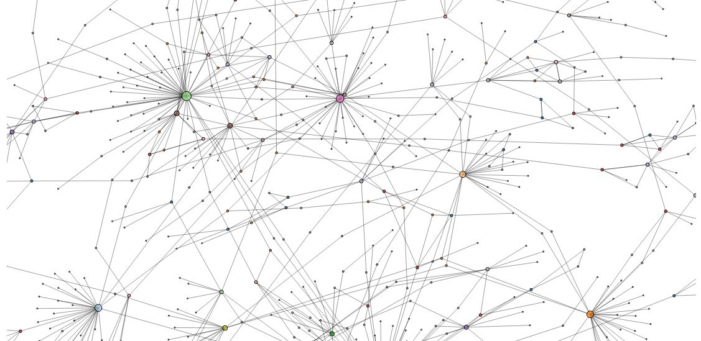
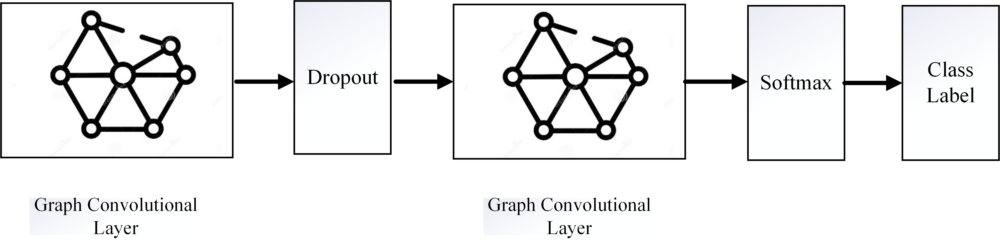
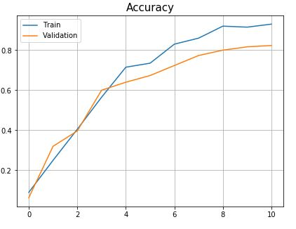

# Supervised Node Classification using Graph Convolutional Network

This repository contains the CORA dataset and code for node classification using GCN. 

The dataset looks like this:

To solve this problem we have implemented the following model.

After training the model, we got the following accuracy.

